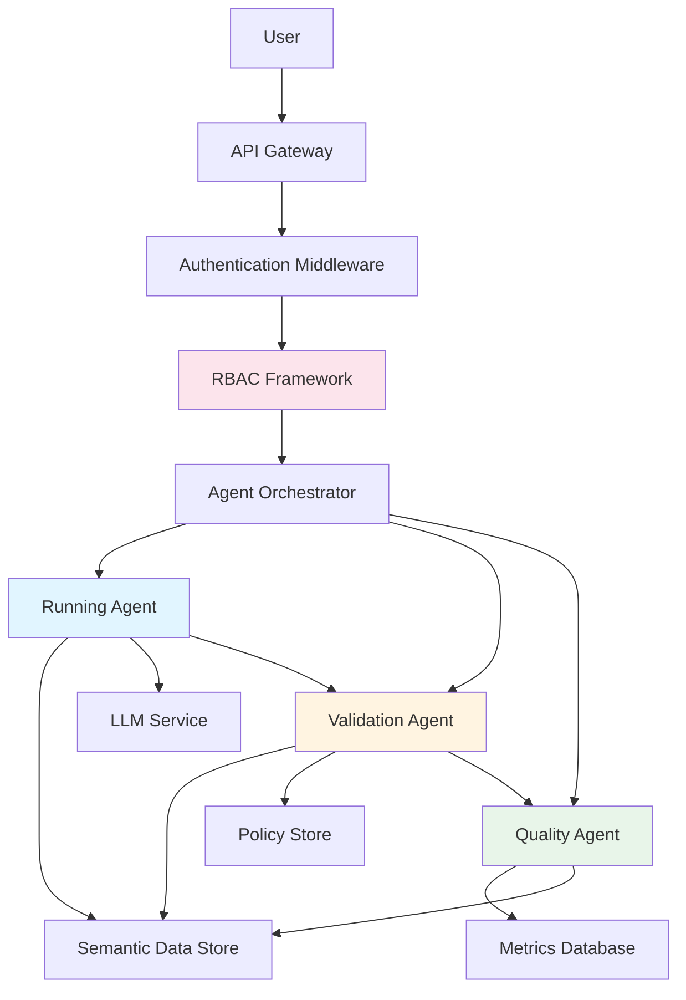
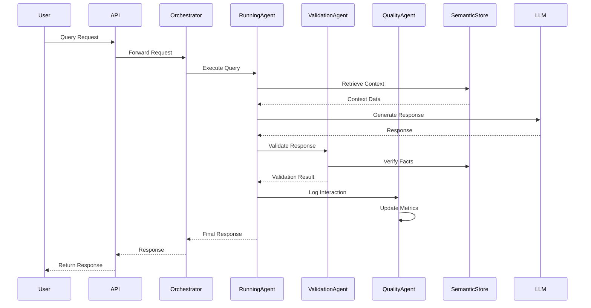
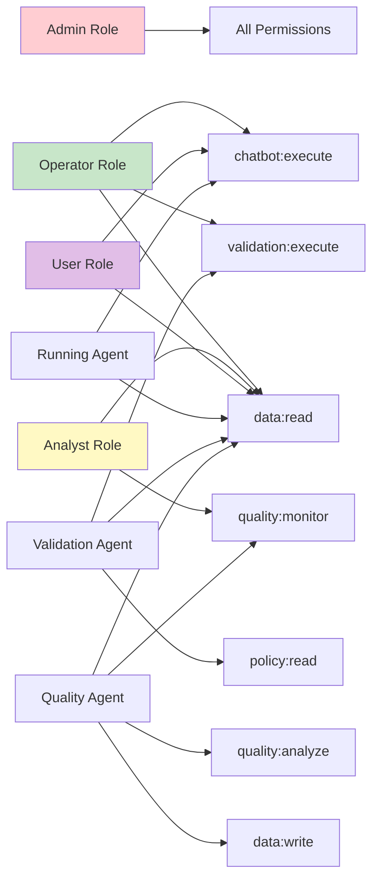
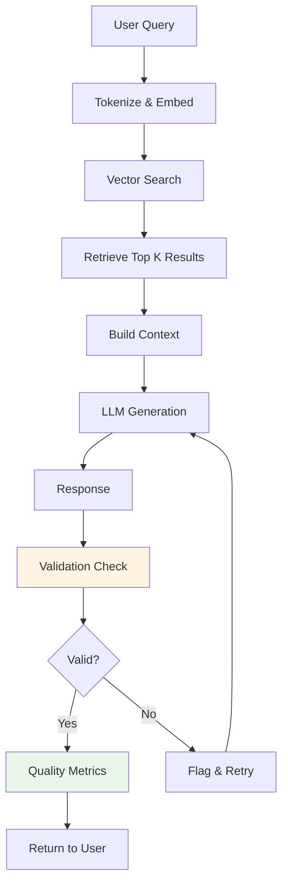

# Architecture Diagrams

## System Architecture

## Agent Interaction Flow

## RBAC Permission Model

## Data Flow

## Component Responsibilities

### API Gateway
- Request routing
- Authentication
- Rate limiting
- Request/response logging

### Agent Orchestrator
- Agent coordination
- Workflow management
- Error handling
- Result aggregation

### Running Agent
- Query processing
- Context retrieval
- Response generation
- Interaction logging

### Validation Agent
- Content validation
- Fact checking
- Policy compliance
- Safety checks

### Quality Agent
- Metric collection
- Performance monitoring
- Quality analysis
- Reporting

### RBAC Framework
- Role management
- Permission checking
- Access control
- Audit logging
