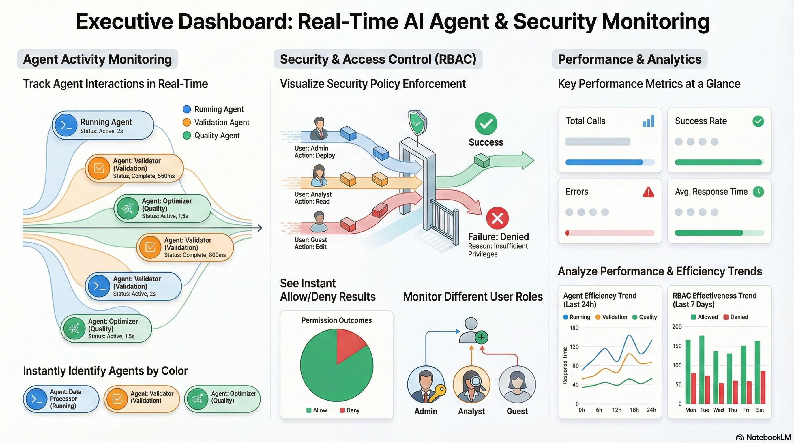
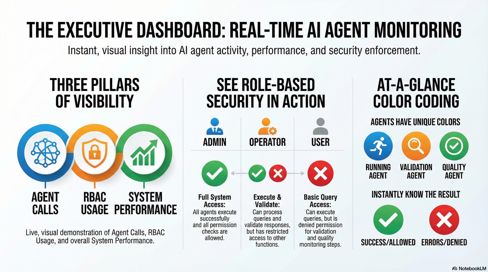

# Executive Dashboard Guide

## Overview

The Executive Dashboard provides a real-time, visual demonstration of:
1. **Agent Calls** - When and how agents are being called
2. **RBAC Usage** - How role-based access control is enforced at each agent level
3. **System Performance** - Metrics and analytics




## Quick Start

### 1. Install Dependencies

```bash
pip install -r requirements.txt
```

**Required packages:**
- streamlit (dashboard framework)
- plotly (interactive charts)
- pandas (data manipulation)
- chromadb (vector database)
- requests (Ollama API calls)

### 2. Generate Demo Data (Recommended)

```bash
python3 demo_dashboard.py
```

This creates sample data including:
- 30 agent call events across all 3 agents
- 39 RBAC check events (all 9 permissions for admin)
- Ready-to-visualize data

### 3. Start the Dashboard

```bash
streamlit run dashboard.py
```

The dashboard will open in your browser at `http://localhost:8501`

**Note**: On first run, ChromaDB downloads a 79MB embedding model. Wait 1-2 minutes if you see initialization messages.

## Features



### 📊 Overview Tab
- **Key Metrics**: Total calls, success rate, errors, RBAC checks
- **Agent Performance Charts**: Visual representation of agent activity
- **Response Time Analysis**: Average duration per agent

### 🤖 Agent Activity Tab
- **Real-time Timeline**: See when each agent is called
- **Call Details**: View recent agent calls with status and duration
- **Color-coded Agents**: 
  - 🔵 Running Agent (blue)
  - 🟠 Validation Agent (orange)
  - 🟢 Quality Agent (green)

### 🔐 RBAC Monitoring Tab
- **Permission Checks**: See all RBAC checks in real-time with ✅/❌ indicators
- **Allow/Deny Rates**: Visual breakdown of permission results (pie chart)
- **Permission Chart**: Bar chart showing all 9 permissions for admin
- **Recent RBAC Checks Table**: Formatted table with readable results column
- **User Permissions**: View current user's all available permissions
- **Permission Statistics**: Summary metrics (Allowed/Denied counts and rates)

### 📈 Analytics Tab
- **Agent Efficiency**: Success rate vs. call volume
- **RBAC Effectiveness**: Permission allow rates
- **Performance Trends**: Historical analysis

## Using the Dashboard

### Testing Agent Calls

1. **Select a User** from the sidebar dropdown
   - `admin` - Full access
   - `operator1` - Execute and validate
   - `user1` - Basic access

2. **Enter a Test Query** in the sidebar
   - Example: "What is semantic search?"

3. **Click "Execute Query"**
   - Watch agents execute in real-time
   - See RBAC checks happen automatically
   - View results in the dashboard

### Understanding RBAC Visualization

When you execute a query, you'll see:

1. **Running Agent** calls `check_permission("chatbot:execute")`
   - ✅ Allowed if user has permission
   - ❌ Denied if user lacks permission

2. **Validation Agent** calls `check_permission("validation:execute")`
   - Only executes if permission granted

3. **Quality Agent** calls `check_permission("quality:monitor")`
   - Tracks metrics if permission granted

### Real-time Updates

- Enable **Auto-refresh** to see live updates
- Adjust refresh interval (1-10 seconds)
- Dashboard updates automatically as agents execute

## Demonstration Scenarios

### Scenario 1: Admin User
- **User**: admin
- **Expected**: All agents execute successfully
- **RBAC**: All permissions allowed
- **Result**: Full system access

### Scenario 2: Operator User
- **User**: operator1
- **Expected**: Can execute and validate
- **RBAC**: `chatbot:execute`, `validation:execute` allowed
- **Result**: Can process queries and validate responses

### Scenario 3: Regular User
- **User**: user1
- **Expected**: Can execute queries only
- **RBAC**: `chatbot:execute` allowed, `validation:execute` denied
- **Result**: Queries execute, but validation may be skipped

## Visual Elements

### Color Coding

- **Green** (#28a745): Success, Allowed permissions
- **Red** (#dc3545): Errors, Denied permissions
- **Blue** (#1f77b4): Running Agent
- **Orange** (#ff7f0e): Validation Agent
- **Green** (#2ca02c): Quality Agent

### Charts

- **Bar Charts**: Agent call counts, permission checks
- **Timeline Charts**: Real-time agent activity
- **Pie Charts**: RBAC check results
- **Scatter Plots**: Efficiency analysis

## Tips for Executive Presentation

1. **Start with Overview Tab**: Show high-level metrics
2. **Execute a Test Query**: Demonstrate live agent execution
3. **Switch Users**: Show RBAC differences between roles
4. **Show RBAC Tab**: Highlight security enforcement
5. **Use Analytics Tab**: Show performance insights

## Troubleshooting

### Dashboard not loading
- Ensure all dependencies are installed: `pip install -r requirements.txt`
- Check if port 8501 is available: `lsof -ti:8501`
- Check logs: `tail -f /tmp/dashboard.log`

### No data showing
- Run `python3 demo_dashboard.py` to generate demo data
- Execute a test query in the dashboard sidebar
- Check if monitoring database exists: `ls -la monitoring.db`

### Agents not executing
- **Ollama issues**: 
  - Ensure Ollama is running: `ollama serve` or check Ollama app
  - Verify model exists: `ollama list`
  - Set correct model: `export LLM_MODEL="llama3.2"` (or your model)
- **ChromaDB initialization**: Wait 1-2 minutes for first-time download (79MB)
- **Semantic store error**: Check if `databases/chroma_db` directory exists

### RBAC table unreadable
- **Fixed!** Results now show ✅ Allowed / ❌ Denied
- Table formatting improved with better column widths
- Summary metrics added below table

### Permission chart only showing 6 permissions
- Regenerate demo data: `python3 demo_dashboard.py`
- Admin should show all 9 permissions after regeneration
- Execute queries to generate more RBAC checks

## Architecture

The dashboard connects to:
- **Monitoring Database**: Tracks agent calls and RBAC checks
- **RBAC Framework**: Manages permissions
- **Agent System**: Executes queries

All events are tracked in real-time and displayed visually.

## Customization

### Change Colors
Edit the color mappings in `dashboard.py`:
```python
colors = {"RunningAgent": "#1f77b4", "ValidationAgent": "#ff7f0e", "QualityAgent": "#2ca02c"}
```

### Add Metrics
Extend `EventTracker` class to track additional metrics

### Custom Charts
Use Plotly to create custom visualizations

## Best Practices

1. **Run Multiple Queries**: Generate more data for better visualization
2. **Test Different Users**: Show RBAC enforcement
3. **Monitor Over Time**: Use auto-refresh for live monitoring
4. **Export Data**: Use Streamlit's data export features

## Support

For issues or questions:
- Check logs in the terminal
- Review agent execution logs
- Verify RBAC configuration
