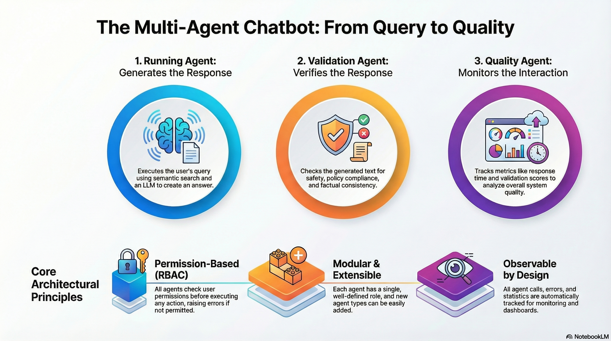

# Agents System Documentation

## Overview

The Agents system implements a multi-agent architecture for the Semantic Data Chatbot. Each agent is responsible for a specific aspect of the chatbot's operation: query execution, response validation, and quality monitoring. All agents inherit from `BaseAgent` and integrate with the RBAC framework for permission-based access control.



## Table of Contents

- [Architecture](#architecture)
- [Base Agent](#base-agent)
- [Running Agent](#running-agent)
- [Validation Agent](#validation-agent)
- [Quality Agent](#quality-agent)
- [Agent Orchestration](#agent-orchestration)
- [Permission Requirements](#permission-requirements)
- [Usage Examples](#usage-examples)
- [Extending Agents](#extending-agents)
- [Best Practices](#best-practices)

## Architecture

The agent system follows a hierarchical architecture:

```
BaseAgent (Abstract Base Class)
├── RunningAgent - Executes queries and generates responses
├── ValidationAgent - Validates responses before delivery
└── QualityAgent - Monitors and analyzes system quality
```

### Key Principles

1. **Permission-Based**: All agents check permissions before executing
2. **Modular**: Each agent has a single, well-defined responsibility
3. **Observable**: All agent calls are tracked for monitoring
4. **Extensible**: Easy to add new agent types by extending BaseAgent

## Base Agent

The `BaseAgent` class provides common functionality for all agents.

### Core Features

- **Permission Checking**: Integrated RBAC permission verification
- **Logging**: Built-in logging for requests and errors
- **Statistics**: Tracks requests processed, errors, and last request time
- **Monitoring**: Automatic event tracking for dashboard visualization

### BaseAgent API

```python
class BaseAgent(ABC):
    def __init__(self, agent_id: str, name: str, rbac: RBACFramework, user_id: str)
    
    def check_permission(self, permission: Permission) -> bool
    def require_permission(self, permission: Permission)
    def log_request(self, request_data: Dict[str, Any])
    def log_error(self, error: Exception, context: Optional[Dict[str, Any]] = None)
    def get_stats(self) -> Dict[str, Any]
    
    @abstractmethod
    def execute(self, **kwargs) -> Dict[str, Any]
```

### Permission Methods

#### `check_permission(permission: Permission) -> bool`
Checks if the agent's user has a specific permission. Automatically tracks the check for monitoring.

```python
if agent.check_permission(Permission.CHATBOT_EXECUTE):
    # Proceed with operation
    pass
```

#### `require_permission(permission: Permission)`
Raises `PermissionError` if the user doesn't have the permission. Use this for mandatory permission checks.

```python
# This will raise PermissionError if user lacks permission
agent.require_permission(Permission.VALIDATION_EXECUTE)
```

### Statistics

Each agent tracks:
- `requests_processed`: Total number of requests handled
- `errors`: Total number of errors encountered
- `last_request`: Timestamp of the last request

```python
stats = agent.get_stats()
print(f"Requests: {stats['requests_processed']}")
print(f"Errors: {stats['errors']}")
```

## Running Agent

The `RunningAgent` is responsible for executing user queries and generating responses using semantic search and LLM integration.

### Purpose

- Execute chatbot queries
- Retrieve relevant context from semantic store
- Generate responses using LLM
- Return formatted results with metadata

### Initialization

```python
from src.agents import RunningAgent
from src.rbac import RBACFramework
from src.semantic_store import SemanticStore
from src.llm_client import LLMClient

rbac = RBACFramework(db_path="databases/rbac.db")
semantic_store = SemanticStore(collection_name="semantic_data")
llm_client = LLMClient(provider="ollama", model="llama3.2")

agent = RunningAgent(
    agent_id="running_001",
    rbac=rbac,
    user_id="admin",
    semantic_store=semantic_store,
    llm_client=llm_client
)
```

### Execute Method

```python
result = agent.execute(
    query="What is semantic search?",
    context_limit=5  # Number of context documents to retrieve
)
```

**Parameters:**
- `query` (str): User's query string
- `context_limit` (int): Number of relevant documents to retrieve (default: 5)
- `**kwargs`: Additional parameters passed to LLM client

**Returns:**
```python
{
    "response": "Semantic search is...",
    "query": "What is semantic search?",
    "context_docs": 5,
    "metadata": {
        "model": "llama3.2",
        "tokens_used": 150,
        "timestamp": "2024-01-09T12:00:00"
    },
    "agent_id": "running_001"
}
```

### Stream Response Method

For real-time streaming responses:

```python
for token in agent.stream_response(query="What is semantic search?"):
    print(token, end="", flush=True)
```

**Yields:** Response tokens as they are generated by the LLM

### Permission Requirements

- `Permission.CHATBOT_EXECUTE` - Required to execute queries
- `Permission.DATA_READ` - Required to read from semantic store

### Workflow

1. **Permission Check**: Verifies user has `CHATBOT_EXECUTE` and `DATA_READ`
2. **Semantic Search**: Retrieves relevant context documents
3. **Context Building**: Formats context for LLM
4. **LLM Generation**: Generates response using LLM with context
5. **Result Formatting**: Returns structured result with metadata

### Example Usage

```python
from src.agents import RunningAgent
from src.rbac import RBACFramework, Permission

# Initialize
rbac = RBACFramework(db_path="databases/rbac.db")
# ... initialize semantic_store and llm_client ...

agent = RunningAgent(
    agent_id="running_001",
    rbac=rbac,
    user_id="admin",
    semantic_store=semantic_store,
    llm_client=llm_client
)

# Execute query
try:
    result = agent.execute(query="Explain machine learning")
    print(f"Response: {result['response']}")
    print(f"Used {result['context_docs']} context documents")
except PermissionError as e:
    print(f"Permission denied: {e}")
except Exception as e:
    print(f"Error: {e}")
```

## Validation Agent

The `ValidationAgent` validates chatbot responses before delivery, ensuring they meet quality, safety, and policy requirements.

### Purpose

- Validate response length and format
- Check for unsafe or inappropriate content
- Verify factual consistency with data store
- Ensure policy compliance
- Calculate validation scores

### Initialization

```python
from src.agents import ValidationAgent

agent = ValidationAgent(
    agent_id="validation_001",
    rbac=rbac,
    user_id="admin",
    semantic_store=semantic_store,
    policies=None  # Uses default policies if None
)
```

### Execute Method

```python
validation_result = agent.execute(
    response="Generated response text",
    query="Original user query"
)
```

**Parameters:**
- `response` (str): Response text to validate
- `query` (str): Original user query (for context)
- `**kwargs`: Additional parameters

**Returns:**
```python
{
    "is_valid": True,
    "checks": {
        "length_check": {"passed": True, "severity": "info", ...},
        "safety_check": {"passed": True, "severity": "info", ...},
        "factual_consistency": {"passed": True, "severity": "info", ...},
        "policy_compliance": {"passed": True, "severity": "info", ...},
        "format_check": {"passed": True, "severity": "info", ...}
    },
    "warnings": [],
    "errors": [],
    "score": 1.0  # 0.0 to 1.0
}
```

### Validation Checks

#### 1. Length Check
- Verifies response length is within acceptable range
- Default: 10 to 10,000 characters
- Configurable via policies

#### 2. Safety Check
- Checks for unsafe or inappropriate content
- Uses pattern matching (configurable patterns)
- Returns warnings for potential issues

#### 3. Factual Consistency
- Verifies claims against semantic store
- Extracts key terms and checks against data
- Calculates consistency score (0.0 to 1.0)

#### 4. Policy Compliance
- Checks against defined policy rules
- Pattern-based rule matching
- Returns violations if found

#### 5. Format Check
- Verifies response has content
- Checks for proper sentence endings
- Validates basic formatting

### Custom Policies

```python
custom_policies = {
    "min_length": 20,
    "max_length": 5000,
    "unsafe_patterns": [
        r"\b(bad_word|another_pattern)\b"
    ],
    "rules": [
        {
            "name": "No personal information",
            "type": "pattern",
            "pattern": r"\b\d{3}-\d{2}-\d{4}\b"  # SSN pattern
        }
    ]
}

agent = ValidationAgent(
    agent_id="validation_001",
    rbac=rbac,
    user_id="admin",
    semantic_store=semantic_store,
    policies=custom_policies
)
```

### Permission Requirements

- `Permission.VALIDATION_EXECUTE` - Required to execute validation
- `Permission.DATA_READ` - Required to check factual consistency
- `Permission.POLICY_READ` - Required to read validation policies

### Validation Score

The validation score is calculated as:
```
score = (passed_checks / total_checks)
```

- Range: 0.0 (all failed) to 1.0 (all passed)
- Used for quality metrics and reporting

### Example Usage

```python
from src.agents import ValidationAgent

agent = ValidationAgent(
    agent_id="validation_001",
    rbac=rbac,
    user_id="operator1",  # Must have VALIDATION_EXECUTE permission
    semantic_store=semantic_store
)

# Validate a response
try:
    result = agent.execute(
        response="This is a valid response about semantic search.",
        query="What is semantic search?"
    )
    
    if result["is_valid"]:
        print(f"✅ Validation passed (score: {result['score']:.2f})")
    else:
        print(f"❌ Validation failed")
        print(f"Errors: {result['errors']}")
        print(f"Warnings: {result['warnings']}")
        
except PermissionError as e:
    print(f"Permission denied: {e}")
    # User needs 'operator' or 'admin' role
```

## Quality Agent

The `QualityAgent` monitors and analyzes system quality by tracking interaction metrics and generating quality reports.

### Purpose

- Track interaction quality metrics
- Store quality data in database
- Analyze quality trends over time
- Generate quality reports
- Calculate quality scores

### Initialization

```python
from src.agents import QualityAgent

agent = QualityAgent(
    agent_id="quality_001",
    rbac=rbac,
    user_id="admin",
    metrics_db_path="quality_metrics.db"  # Optional
)
```

### Execute Method (Track Quality)

Records a single interaction's quality metrics:

```python
quality_result = agent.execute({
    "query": "User query",
    "response": "Generated response",
    "response_time": 1.5,  # seconds
    "validation_score": 0.95,
    "user_satisfaction": 4.5,  # Optional: 1-5 scale
    "agent_id": "running_001"
})
```

**Parameters:**
- `interaction_data` (Dict[str, Any]): Interaction data dictionary
  - `query`: User query
  - `response`: Generated response
  - `response_time`: Response time in seconds
  - `validation_score`: Validation score (0.0-1.0)
  - `user_satisfaction`: Optional satisfaction rating (1-5)
  - `agent_id`: ID of agent that generated response

**Returns:**
```python
{
    "interaction_id": 123,
    "metrics": {
        "response_time_score": 0.85,
        "validation_score": 0.95,
        "satisfaction_score": 0.9,
        "overall_quality": 0.9
    },
    "timestamp": "2024-01-09T12:00:00",
    "agent_id": "quality_001"
}
```

### Analyze Quality Method

Analyzes quality metrics over a time period:

```python
analysis = agent.analyze_quality(time_period_hours=24)
```

**Parameters:**
- `time_period_hours` (int): Number of hours to analyze (default: 24)

**Returns:**
```python
{
    "time_period_hours": 24,
    "total_interactions": 150,
    "average_response_time": 1.2,
    "average_validation_score": 0.92,
    "average_satisfaction": 4.3,
    "quality_score": 0.88,
    "timestamp": "2024-01-09T12:00:00"
}
```

### Get Quality Report Method

Generates comprehensive quality report for multiple time periods:

```python
report = agent.get_quality_report()
```

**Returns:**
```python
{
    "reports": {
        "last_hour": {...},
        "last_24_hours": {...},
        "last_7_days": {...}
    },
    "generated_at": "2024-01-09T12:00:00",
    "agent_id": "quality_001"
}
```

### Permission Requirements

**For `execute()` (tracking):**
- `Permission.QUALITY_MONITOR` - Required to monitor quality
- `Permission.DATA_WRITE` - Required to store metrics

**For `analyze_quality()` and `get_quality_report()`:**
- `Permission.QUALITY_ANALYZE` - Required to analyze quality
- `Permission.DATA_READ` - Required to read metrics

### Quality Metrics

The agent calculates several metrics:

1. **Response Time Score**: Normalized score based on response time (faster = better)
2. **Validation Score**: Direct validation score from ValidationAgent
3. **Satisfaction Score**: User satisfaction rating (if provided)
4. **Overall Quality**: Weighted combination of all metrics

### Quality Score Calculation

```python
quality_score = (
    validation_score * 0.4 +
    satisfaction_score * 0.4 +
    response_time_score * 0.2
)
```

### Database Schema

The QualityAgent uses SQLite with two tables:

**Interactions Table:**
```sql
CREATE TABLE interactions (
    interaction_id INTEGER PRIMARY KEY AUTOINCREMENT,
    query TEXT,
    response TEXT,
    response_time REAL,
    validation_score REAL,
    user_satisfaction REAL,
    timestamp TIMESTAMP DEFAULT CURRENT_TIMESTAMP,
    agent_id TEXT
)
```

**Quality Metrics Table:**
```sql
CREATE TABLE quality_metrics (
    metric_id INTEGER PRIMARY KEY AUTOINCREMENT,
    metric_name TEXT,
    metric_value REAL,
    timestamp TIMESTAMP DEFAULT CURRENT_TIMESTAMP
)
```

### Example Usage

```python
from src.agents import QualityAgent

agent = QualityAgent(
    agent_id="quality_001",
    rbac=rbac,
    user_id="admin"
)

# Track an interaction
try:
    result = agent.execute({
        "query": "What is AI?",
        "response": "AI is artificial intelligence...",
        "response_time": 1.5,
        "validation_score": 0.95,
        "user_satisfaction": 4.5,
        "agent_id": "running_001"
    })
    print(f"Quality tracked: {result['metrics']['overall_quality']:.2f}")
except PermissionError as e:
    print(f"Permission denied: {e}")

# Analyze quality
try:
    analysis = agent.analyze_quality(time_period_hours=24)
    print(f"Average quality score: {analysis['quality_score']:.2f}")
    print(f"Total interactions: {analysis['total_interactions']}")
except PermissionError as e:
    print(f"Permission denied: {e}")
```

## Agent Orchestration

Agents are orchestrated by the `AgentOrchestrator` class, which coordinates the execution flow:

```
User Query
    ↓
RunningAgent (execute query)
    ↓
ValidationAgent (validate response)
    ↓
QualityAgent (track quality)
    ↓
Return Result
```

### Orchestrator Usage

```python
from src.orchestrator import AgentOrchestrator

orchestrator = AgentOrchestrator(
    rbac=rbac,
    user_id="admin",
    running_agent=running_agent,
    validation_agent=validation_agent,
    quality_agent=quality_agent
)

# Process query through all agents
result = orchestrator.process_query(
    query="What is semantic search?",
    validate=True,      # Run validation
    track_quality=True  # Track quality metrics
)
```

## Permission Requirements Summary

### RunningAgent
- **Required**: `CHATBOT_EXECUTE`, `DATA_READ`
- **Role**: `user`, `operator`, or `admin`

### ValidationAgent
- **Required**: `VALIDATION_EXECUTE`, `DATA_READ`, `POLICY_READ`
- **Role**: `operator` or `admin`

### QualityAgent
- **Tracking**: `QUALITY_MONITOR`, `DATA_WRITE`
- **Analysis**: `QUALITY_ANALYZE`, `DATA_READ`
- **Role**: `analyst` or `admin` (for analysis), `admin` (for tracking)

## Usage Examples

### Complete Agent Setup

```python
from src.rbac import RBACFramework
from src.agents import RunningAgent, ValidationAgent, QualityAgent
from src.semantic_store import SemanticStore
from src.llm_client import LLMClient
from src.orchestrator import AgentOrchestrator

# Initialize components
rbac = RBACFramework(db_path="databases/rbac.db")
semantic_store = SemanticStore(collection_name="semantic_data")
llm_client = LLMClient(provider="ollama", model="llama3.2")

# Create agents
running_agent = RunningAgent(
    agent_id="running_001",
    rbac=rbac,
    user_id="admin",
    semantic_store=semantic_store,
    llm_client=llm_client
)

validation_agent = ValidationAgent(
    agent_id="validation_001",
    rbac=rbac,
    user_id="admin",
    semantic_store=semantic_store
)

quality_agent = QualityAgent(
    agent_id="quality_001",
    rbac=rbac,
    user_id="admin"
)

# Create orchestrator
orchestrator = AgentOrchestrator(
    rbac=rbac,
    user_id="admin",
    running_agent=running_agent,
    validation_agent=validation_agent,
    quality_agent=quality_agent
)

# Process query
result = orchestrator.process_query(
    query="What is semantic search?",
    validate=True,
    track_quality=True
)

print(f"Response: {result['response']}")
print(f"Validated: {result['metadata']['validated']}")
print(f"Quality tracked: {result['metadata']['quality_tracked']}")
```

### Individual Agent Usage

```python
# Running Agent
response = running_agent.execute(query="Explain AI")
print(response["response"])

# Validation Agent
validation = validation_agent.execute(
    response=response["response"],
    query="Explain AI"
)
print(f"Valid: {validation['is_valid']}, Score: {validation['score']}")

# Quality Agent
quality = quality_agent.execute({
    "query": "Explain AI",
    "response": response["response"],
    "response_time": 1.5,
    "validation_score": validation["score"]
})
print(f"Quality: {quality['metrics']['overall_quality']}")
```

### Error Handling

```python
try:
    result = running_agent.execute(query="Test query")
except PermissionError as e:
    print(f"Permission denied: {e}")
    # User needs appropriate role/permissions
except Exception as e:
    print(f"Error: {e}")
    # Handle other errors
```

## Extending Agents

### Creating a New Agent

To create a new agent type, extend `BaseAgent`:

```python
from src.agents.base import BaseAgent
from src.rbac.framework import Permission
from typing import Dict, Any

class CustomAgent(BaseAgent):
    """Custom agent for specific functionality"""
    
    def __init__(self, agent_id: str, rbac, user_id: str, custom_param: str):
        super().__init__(agent_id, "CustomAgent", rbac, user_id)
        self.custom_param = custom_param
    
    def execute(self, **kwargs) -> Dict[str, Any]:
        """Execute custom agent logic"""
        # Check permissions
        self.require_permission(Permission.DATA_READ)
        
        # Custom logic here
        self.log_request({"custom_param": self.custom_param})
        
        return {
            "result": "Custom operation completed",
            "agent_id": self.agent_id
        }
```

### Required Implementation

All agents must implement:
- `execute(**kwargs) -> Dict[str, Any]`: Main execution method

### Best Practices for New Agents

1. **Check Permissions**: Always use `require_permission()` or `check_permission()`
2. **Log Requests**: Call `log_request()` for each operation
3. **Handle Errors**: Use `log_error()` for exceptions
4. **Return Structured Data**: Return dictionaries with consistent structure
5. **Document Permissions**: Clearly document required permissions

## Best Practices

### 1. Permission Checking

Always check permissions before executing operations:

```python
# Good: Check permission first
if agent.check_permission(Permission.CHATBOT_EXECUTE):
    result = agent.execute(query="...")
else:
    raise PermissionError("Cannot execute query")

# Better: Use require_permission (raises automatically)
agent.require_permission(Permission.CHATBOT_EXECUTE)
result = agent.execute(query="...")
```

### 2. Error Handling

Handle permission errors gracefully:

```python
try:
    result = agent.execute(query="...")
except PermissionError as e:
    logger.warning(f"Permission denied: {e}")
    # Return error to user or retry with different user
except Exception as e:
    logger.error(f"Agent error: {e}", exc_info=True)
    # Handle other errors
```

### 3. User Context

Always set the correct user_id for agents:

```python
# Update agent user when switching users
agent.user_id = new_user_id
# Or create new agent instance
new_agent = RunningAgent(..., user_id=new_user_id)
```

### 4. Monitoring Integration

All agent calls are automatically tracked if monitoring is enabled:

```python
from src.monitoring import get_event_tracker

# Agent calls are automatically tracked
# No additional code needed
result = agent.execute(query="...")
```

### 5. Agent Lifecycle

- **Initialization**: Create agents once, reuse them
- **User Switching**: Update `user_id` or create new instances
- **Cleanup**: Agents don't require explicit cleanup (Python GC handles it)

### 6. Performance Considerations

- **Semantic Store**: Initialize once, reuse across agents
- **LLM Client**: Reuse LLM client instances (they manage connections)
- **Database Connections**: Framework handles connection pooling

## Troubleshooting

### Permission Denied Errors

**Problem:** Agent raises `PermissionError`

**Solution:**
```python
# Check user's permissions
permissions = rbac.get_user_permissions(user_id)
print(f"User permissions: {[p.value for p in permissions]}")

# Grant appropriate role
rbac.assign_role(user_id, "operator")  # For validation
rbac.assign_role(user_id, "admin")      # For all permissions
```

### Agent Not Initialized

**Problem:** `None` agent in orchestrator

**Solution:**
- Ensure semantic store is initialized before creating RunningAgent
- Check ChromaDB is ready (may take time on first use)
- Handle optional agents gracefully in orchestrator

### Validation Always Fails

**Problem:** Validation agent always returns `is_valid: False`

**Solution:**
- Check validation policies (may be too strict)
- Review validation checks in result
- Adjust policy thresholds if needed

### Quality Metrics Not Recording

**Problem:** QualityAgent not storing metrics

**Solution:**
- Check user has `QUALITY_MONITOR` and `DATA_WRITE` permissions
- Verify database path is writable
- Check database file permissions

## API Reference

### BaseAgent

#### `__init__(agent_id: str, name: str, rbac: RBACFramework, user_id: str)`
Initialize base agent with ID, name, RBAC instance, and user ID.

#### `check_permission(permission: Permission) -> bool`
Check if agent's user has permission. Tracks check for monitoring.

#### `require_permission(permission: Permission)`
Raise `PermissionError` if user lacks permission.

#### `log_request(request_data: Dict[str, Any])`
Log a request for statistics tracking.

#### `log_error(error: Exception, context: Optional[Dict[str, Any]] = None)`
Log an error with optional context.

#### `get_stats() -> Dict[str, Any]`
Get agent statistics (requests, errors, timestamps).

### RunningAgent

#### `execute(query: str, context_limit: int = 5, **kwargs) -> Dict[str, Any]`
Execute a chatbot query and return response.

#### `stream_response(query: str, context_limit: int = 5, **kwargs) -> Iterator[str]`
Stream response tokens as they are generated.

### ValidationAgent

#### `execute(response: str, query: str, **kwargs) -> Dict[str, Any]`
Validate a chatbot response and return validation results.

### QualityAgent

#### `execute(interaction_data: Dict[str, Any], **kwargs) -> Dict[str, Any]`
Record quality metrics for an interaction.

#### `analyze_quality(time_period_hours: int = 24, **kwargs) -> Dict[str, Any]`
Analyze quality metrics over a time period.

#### `get_quality_report(**kwargs) -> Dict[str, Any]`
Generate comprehensive quality report for multiple time periods.

## Related Documentation

- [RBAC README](../rbac/README.md) - Permission system details
- [Orchestrator](../orchestrator.py) - Agent coordination
- [Main README](../../README.md) - Overall system documentation
- [Dashboard Guide](../../DASHBOARD_GUIDE.md) - Visual agent monitoring
